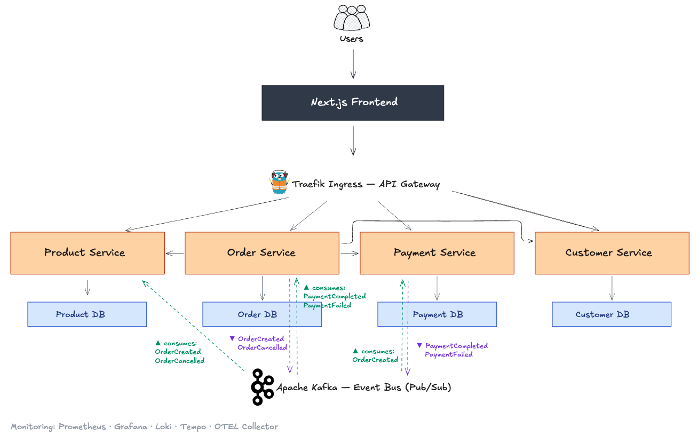

# E-Commerce Microservices Platform

[한국어](README.md) | [English](README-en.md) | [中文](README-zh.md)

이커머스 도메인(Product, Order, Payment, Customer)을 위한 Spring Boot 기반 마이크로서비스 플랫폼입니다. 도메인 주도 설계(DDD)를 중심으로 Kafka 기반 이벤트 드리븐 통신과 RestClient 기반 동기 호출을 조합하여 구성했으며, 로컬은 Docker Compose, 운영은 Kubernetes로 배포할 수 있도록 패키징되어 있습니다.


## 개요

본 프로젝트는 이커머스 백엔드를 서로 협력하는 마이크로서비스 집합으로 구현합니다. 각 서비스는 자체 데이터베이스를 소유하며, 조회·재고 예약 등은 동기 REST 호출로, 주문·결제 오케스트레이션은 Kafka 비동기 이벤트로 통신합니다. 서비스 경계, 이벤트 흐름, 배포 토폴로지를 명확하게 파악할 수 있도록 불필요한 추상화는 의도적으로 배제했습니다.

## 시스템 아키텍처



## 핵심 아키텍처

다음과 같은 아키텍처 패턴을 사용합니다:

- **마이크로서비스 아키텍처**: Bounded Context 단위로 독립 서비스 구성, 각자 DB 소유
- **도메인 주도 설계**: Bounded Context별 Aggregate, Value Object, Domain Event 중심의 풍부한 도메인 모델
- **이벤트 드리븐 아키텍처**: Kafka 기반 서비스 간 비동기 오케스트레이션
- **동기 서비스 간 호출**: Spring `RestClient`로 타임아웃과 에러 처리를 갖춘 조회/재고 예약 통신
- **Database-per-Service**: 서비스별로 분리된 MySQL 스키마, 공유 테이블 없음
- **서비스별 계층 아키텍처**: `api` → `application` → `domain` → `infra` 패키지 분리
- **Shared Kernel (`common` 모듈)**: `BaseEntity`, `ApiResponse`, `PageResponse`, `GlobalExceptionHandler`, `BusinessException`, `DomainEvent`, `KafkaTopics`, 공통 Spring 설정

## 기술 스택

**언어 & 프레임워크**

- Java 21 (LTS, Virtual Thread 지원)
- Spring Boot 3.x
- Spring Data JPA / Hibernate
- QueryDSL 5.1 (타입 안전 쿼리)
- Spring Kafka
- jBCrypt (비밀번호 해싱)

**데이터 & 메시징**

- MySQL 8.0 (트랜잭션 데이터, 서비스별 DB)
- Apache Kafka KRaft 모드 (이벤트 스트리밍, ZooKeeper 미사용)

**API & 문서화**

- Spring Web (REST 컨트롤러)
- springdoc-openapi (서비스별 Swagger UI)
- Jakarta Bean Validation (요청 검증)

**빌드 & 배포**

- Gradle 멀티 모듈
- Docker & Docker Compose (로컬 개발)
- Kubernetes (namespace, ConfigMap, Secrets, StatefulSet, Deployment, Ingress)
- GitHub Actions (CI)

**테스트**

- JUnit 5
- Spring Boot Test slice
- Testcontainers (MySQL, Kafka)

## 마이크로서비스

| 서비스 | 포트 | 책임 | 핵심 Aggregate |
|---|---|---|---|
| **service-product** | 8081 | 상품 카탈로그, 브랜드, 재고 | `Product`, `ProductVariant`, `ProductImage`, `Brand` |
| **service-order** | 8082 | 주문 생성, 상태 관리, 취소 | `Order`, `OrderItem`, `ShippingAddress` |
| **service-payment** | 8083 | 결제 처리, 환불 | `Payment` |
| **service-customer** | 8084 | 고객 프로필, 배송지 | `Customer`, `CustomerAddress` |

각 서비스는 `/api/{resource}` 경로로 API를 노출하며, OpenAPI 스펙은 `/swagger-ui.html`에서 확인할 수 있습니다.

## 도메인 문서

DDD 설계 문서는 [`docs/domain/`](docs/domain/)에 있습니다:

- [Ubiquitous Language](docs/domain/01-ubiquitous-language.md)
- [Bounded Context Map](docs/domain/02-bounded-context-map.md)
- [Use Cases](docs/domain/03-use-cases.md)
- [Aggregate Design](docs/domain/04-aggregate-design.md)

## Kafka 이벤트

서비스들은 `common/KafkaTopics.java`에 정의된 도메인 이벤트를 통해 비동기로 통신합니다:

| 토픽 | Producer | Consumer | 용도 |
|---|---|---|---|
| `order.created` | Order | Payment | 결제 처리 트리거 |
| `order.cancelled` | Order | Payment | 이미 결제 완료된 경우 환불 트리거 |
| `payment.completed` | Payment | Order | 주문 상태를 PAID로 전이 |
| `payment.failed` | Payment | Order | 주문 취소 |
| `product.stock-reserved` | Product | (audit / 추후) | 재고 예약 감사 로그 |
| `product.stock-released` | Product | (audit / 추후) | 재고 해제 감사 로그 |
| `customer.registered` | Customer | (notification / 추후) | 신규 고객 가입 알림 |

## 프로젝트 구조

```
ecommerce-microservices/
├── backend-v2/              # Gradle 멀티 모듈 백엔드
│   ├── common/              # Shared Kernel (BaseEntity, ApiResponse, 공통 설정, KafkaTopics)
│   ├── service-product/     # Product 서비스 (8081)
│   ├── service-order/       # Order 서비스 (8082)
│   ├── service-payment/     # Payment 서비스 (8083)
│   ├── service-customer/    # Customer 서비스 (8084)
│   ├── build.gradle         # 루트 빌드 + 의존성 관리
│   └── settings.gradle
├── infra/                   # Docker Compose 파일, 인프라 설정
├── k8s/                     # Kubernetes 매니페스트
│   ├── namespace.yml
│   ├── base/                # MySQL StatefulSet, Kafka Deployment, ConfigMap, Secrets
│   ├── services/            # 서비스별 Deployment + Service 매니페스트
│   └── ingress/             # nginx IngressRoute
├── scripts/                 # 헬퍼 스크립트 (k8s-deploy.sh, k8s-teardown.sh 등)
└── frontend/                # Next.js 16 스토어프론트 (별도 트랙)
```

## 설치 및 구성

### 사전 요구사항

- Java 21+
- Docker & Docker Compose
- Gradle 8.x (wrapper 포함)
- (선택) `kubectl` + 로컬 Kubernetes 클러스터 (k3s, minikube, kind, Docker Desktop)

### 빠른 시작 (Docker Compose)

```bash
# 1. 저장소 클론
git clone https://github.com/lsh1215/ecommerce-microservices.git
cd ecommerce-microservices

# 2. 로컬 MySQL + Kafka 기동
docker compose -f infra/docker-compose.yml up -d

# 3. 백엔드 빌드
cd backend-v2
./gradlew build -x test

# 4. 각 서비스 실행 (별도 터미널 또는 IDE 사용)
./gradlew :service-product:bootRun
./gradlew :service-order:bootRun
./gradlew :service-payment:bootRun
./gradlew :service-customer:bootRun
```

각 서비스는 기본적으로 `local` 프로파일로 실행되어 `localhost:3306` (MySQL), `localhost:9092` (Kafka)에 연결됩니다.

### 동작 확인

```bash
# 헬스 체크
curl http://localhost:8081/actuator/health   # product
curl http://localhost:8082/actuator/health   # order
curl http://localhost:8083/actuator/health   # payment
curl http://localhost:8084/actuator/health   # customer

# Swagger UI
open http://localhost:8081/swagger-ui.html
```

### Kubernetes 배포

```bash
kubectl apply -f k8s/namespace.yml
kubectl apply -f k8s/base/
kubectl apply -f k8s/services/
kubectl apply -f k8s/ingress/
```

매니페스트는 `k8s` 프로파일을 사용하며, 클러스터 내부 DNS로 MySQL/Kafka를 해석하고 CORS와 `ddl-auto` 설정을 운영 수준으로 강화합니다.

## 기여

기여, 이슈, 기능 요청을 환영합니다. 큰 변경을 제안하실 경우 먼저 이슈를 열어 논의해 주세요.

## 라이선스

본 프로젝트는 [MIT License](LICENSE)로 배포됩니다.
