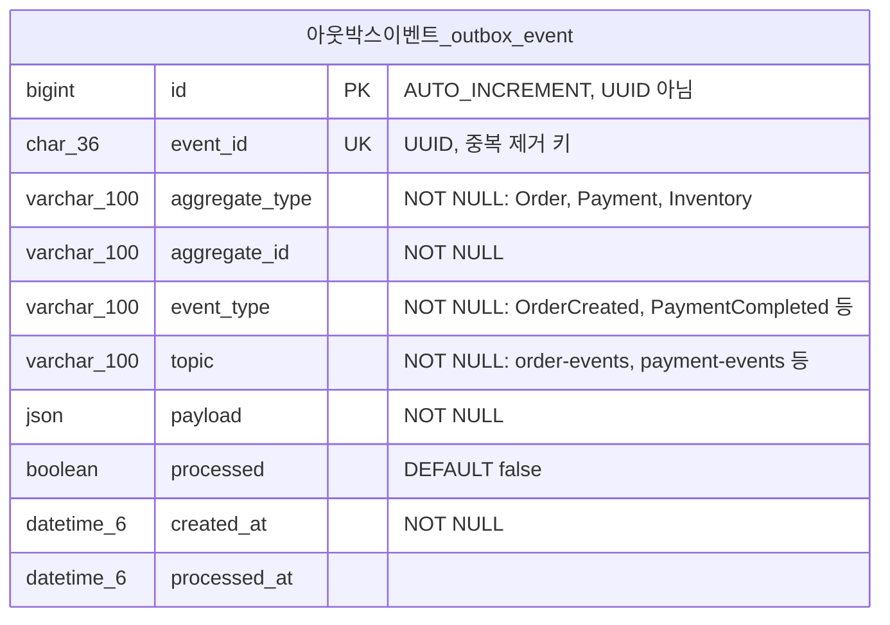

# FOUNDRY ERD — 데이터베이스 스키마 설계

## 설계 원칙

| 원칙 | 결정 | 근거 |
|------|------|------|
| 기본 키 | BIGINT AUTO_INCREMENT (내부) + ULID CHAR(26) (외부 API용) | InnoDB 클러스터드 인덱스 성능을 위한 순차 삽입. ULID는 URL-safe하고 추측 불가능한 외부 ID |
| 관계 | 비식별 관계 (모든 엔티티가 독립적인 대리 키 보유) | JPA 프록시 호환성, 깔끔한 cascade, 단순한 equals/hashCode |
| 정규화 | 카탈로그는 3NF, 주문은 전략적 비정규화 | 주문 스냅샷은 정확성 요구사항이지 편의를 위한 것이 아님 |
| 금액 | DECIMAL(19,4) + CHAR(3) 통화 코드 | KRW/USD/JPY 지원. FLOAT/DOUBLE 절대 사용 금지 |
| 논리 삭제 | `deleted_at DATETIME(6)` (NULL = 활성) | 과거 주문이 참조하는 상품/변형 보존 |
| 감사 | 모든 테이블에 `created_at`, `updated_at` DATETIME(6). 예외: 추가 전용 이벤트 테이블(`inventory_event`, `drop_status_history`, `exchange_rate`)은 행이 불변이므로 `updated_at` 생략 | `@CreatedDate` / `@LastModifiedDate`를 통한 UTC 타임스탬프 |
| 낙관적 락 | Inventory에 `version INT` | 드랍 동시 구매 처리, JPA `@Version` |
| 문자셋 | `utf8mb4` / `utf8mb4_unicode_ci` | 한국어, 영어, 일본어 지원 |
| Enum | `VARCHAR` + `@Enumerated(STRING)` | ORDINAL 절대 금지 — enum 순서 변경 시 데이터 깨짐 |
| 주문 통화 | 하나의 주문 내 모든 항목은 고객의 표시 통화를 공유 | 정산 통화 추적은 범위 밖 (스텁 처리) |

## 도메인 그룹

| 도메인 | 테이블 | FK 정책 |
|--------|--------|---------|
| 카탈로그 | brand, product, product_variant, product_translation, product_image | 실제 FK |
| 재고 | inventory, inventory_event | product_variant에 실제 FK |
| 드랍 | drop_event, drop_product, drop_status_history | brand, product_variant에 실제 FK |
| 주문 | orders, order_item, order_status_history | customer, product_variant에 실제 FK |
| 결제 | payment, payment_event | orders에 실제 FK |
| 고객 | customer, customer_address | 실제 FK |
| 인프라 | exchange_rate | FK 없음 (독립 참조 데이터) |
| *[Phase 3+]* | outbox_event | Kafka 도입 시 추가 |

**Phase 1 (모놀리스)**: 모든 테이블이 단일 MySQL 스키마에 존재. 모든 관계가 실제 FK 제약조건과 JPA `@ManyToOne`/`@OneToMany` 매핑 사용. 완전한 참조 무결성, 완전한 JPA 탐색이 가능한 진짜 모놀리스.

> **Phase 4 마이그레이션 참고**: 서비스 분리 시 다음 FK가 제거되고 단순 BIGINT 참조 + 이벤트 기반 일관성으로 대체: `orders.customer_id`, `order_item.product_variant_id`, `order_item.drop_event_id`, `payment.order_id`, `drop_event.brand_id`. Phase 3에서 추가되는 outbox 테이블은 [Phase 3+ 추가사항](#phase-3-추가사항-kafka--outbox) 참조.

## ERD 다이어그램

```mermaid
erDiagram
    %% ============================================
    %% 카탈로그 컨텍스트
    %% ============================================

    브랜드_brand {
        bigint id PK
        char_26 public_id UK "ULID"
        varchar_100 name "NOT NULL"
        varchar_100 slug UK "NOT NULL"
        char_2 country_of_origin "ISO 3166-1 alpha-2"
        varchar_50 style_category "AMERICANA, WORKWEAR, REPRO"
        smallint founded_year
        text description
        varchar_500 logo_url
        datetime_6 created_at "NOT NULL"
        datetime_6 updated_at "NOT NULL"
        datetime_6 deleted_at "NULL이면 활성"
    }

    상품_product {
        bigint id PK
        char_26 public_id UK "ULID"
        bigint brand_id FK "NOT NULL"
        varchar_150 slug UK "NOT NULL"
        varchar_50 category "NOT NULL: DENIM, OUTERWEAR, SHIRT, KNITWEAR, PANTS, ACCESSORY"
        varchar_50 era "nullable: 1940s_MILITARY, 1950s_WORKWEAR, 1960s_OUTDOOR"
        decimal_19_4 base_price_amount "NOT NULL, 기준 가격"
        char_3 base_price_currency "NOT NULL, ISO 4217"
        decimal_19_4 price_usd "사전 계산, base=USD면 NULL"
        decimal_19_4 price_krw "사전 계산, base=KRW면 NULL"
        decimal_19_4 price_jpy "사전 계산, base=JPY면 NULL"
        decimal_4_1 fabric_weight_oz "예: 14.5oz"
        varchar_50 fabric_type "DENIM, CHAMBRAY, CANVAS, WOOL, COTTON"
        varchar_50 fabric_weave "SELVEDGE, RIGHT_HAND_TWILL, HERRINGBONE"
        datetime_6 created_at "NOT NULL"
        datetime_6 updated_at "NOT NULL"
        datetime_6 deleted_at "NULL이면 활성"
    }

    상품번역_product_translation {
        bigint id PK
        bigint product_id FK "NOT NULL"
        char_2 locale "NOT NULL: en, ko, ja (ISO 639-1)"
        varchar_255 name "NOT NULL"
        text description
        datetime_6 created_at "NOT NULL"
        datetime_6 updated_at "NOT NULL"
    }

    상품이미지_product_image {
        bigint id PK
        bigint product_id FK "NOT NULL"
        varchar_500 url "NOT NULL"
        smallint sort_order "NOT NULL, DEFAULT 0"
        boolean is_primary "DEFAULT false"
        datetime_6 created_at "NOT NULL"
        datetime_6 updated_at "NOT NULL"
    }

    상품변형_product_variant {
        bigint id PK
        char_26 public_id UK "ULID"
        bigint product_id FK "NOT NULL"
        varchar_100 sku UK "NOT NULL"
        varchar_20 size_label "NOT NULL: S, M, L, 28x32 등"
        varchar_50 color_name "Indigo Selvedge, Vintage Black"
        char_7 color_hex "#1C2D3E"
        decimal_19_4 price_override_amount "NULL이면 상품 가격 상속"
        char_3 price_override_currency
        decimal_5_1 meas_chest_cm "가슴"
        decimal_5_1 meas_shoulder_cm "어깨"
        decimal_5_1 meas_sleeve_cm "소매"
        decimal_5_1 meas_body_length_cm "총장"
        decimal_5_1 meas_waist_cm "허리"
        decimal_5_1 meas_inseam_cm "인심"
        decimal_5_1 meas_thigh_cm "허벅지"
        decimal_5_1 meas_hem_cm "밑단"
        datetime_6 created_at "NOT NULL"
        datetime_6 updated_at "NOT NULL"
        datetime_6 deleted_at "NULL이면 활성"
    }

    브랜드_brand ||--o{ 상품_product : "보유"
    상품_product ||--o{ 상품번역_product_translation : "번역"
    상품_product ||--o{ 상품이미지_product_image : "이미지"
    상품_product ||--o{ 상품변형_product_variant : "변형(사이즈/컬러)"

    %% ============================================
    %% 재고 컨텍스트
    %% ============================================

    재고_inventory {
        bigint id PK
        bigint product_variant_id FK UK "NOT NULL, 1:1"
        int quantity_available "NOT NULL, DEFAULT 0, 판매 가능"
        int quantity_reserved "NOT NULL, DEFAULT 0, 예약됨"
        int quantity_sold "NOT NULL, DEFAULT 0, 판매 완료"
        int version "NOT NULL, DEFAULT 0, 낙관적 락"
        datetime_6 created_at "NOT NULL"
        datetime_6 updated_at "NOT NULL"
    }

    재고이벤트_inventory_event {
        bigint id PK
        bigint inventory_id FK "NOT NULL"
        varchar_30 event_type "NOT NULL: RESERVED, DEDUCTED, RELEASED, COMPENSATION_RESTORE, ADJUSTMENT"
        varchar_30 trigger_type "NOT NULL: SYSTEM, SAGA_COMPENSATION, ADMIN, SCHEDULER"
        int quantity_change "NOT NULL, 부호 포함: +5 또는 -5"
        bigint order_id "nullable, 해당 주문"
        bigint drop_event_id "nullable, 해당 드랍"
        varchar_500 reason "예: SAGA 보상 - 결제 실패"
        datetime_6 created_at "NOT NULL, 추가 전용"
    }

    상품변형_product_variant ||--|| 재고_inventory : "재고 보유 (1:1)"
    재고_inventory ||--o{ 재고이벤트_inventory_event : "변동 감사"

    %% ============================================
    %% 드랍 컨텍스트
    %% ============================================

    드랍이벤트_drop_event {
        bigint id PK
        char_26 public_id UK "ULID"
        varchar_200 name "NOT NULL"
        varchar_200 slug UK "NOT NULL"
        bigint brand_id FK "NOT NULL"
        text description "드랍 마케팅 카피"
        varchar_500 banner_image_url "드랍 페이지 히어로 이미지"
        varchar_20 status "NOT NULL: ANNOUNCED, OPEN, SELLING, SOLD_OUT, CLOSED"
        datetime_6 open_at "NOT NULL, 예정 오픈 시각"
        datetime_6 close_at "예정 마감 시각"
        datetime_6 actual_open_at "실제 오픈 시각"
        datetime_6 actual_close_at "실제 마감 시각"
        datetime_6 created_at "NOT NULL"
        datetime_6 updated_at "NOT NULL"
    }

    드랍상품_drop_product {
        bigint id PK
        bigint drop_event_id FK "NOT NULL"
        bigint product_variant_id FK "NOT NULL"
        decimal_19_4 drop_price_amount "드랍 전용 가격"
        char_3 drop_price_currency
        int quantity_allocated "NOT NULL, 이 드랍 할당 수량"
        int quantity_sold "NOT NULL, DEFAULT 0, 판매된 수량"
        tinyint max_per_customer "DEFAULT 1, 1인당 구매 제한"
        smallint sort_order "NOT NULL, DEFAULT 0, 표시 순서"
        int version "NOT NULL, DEFAULT 0, 낙관적 락"
        datetime_6 created_at "NOT NULL"
        datetime_6 updated_at "NOT NULL"
    }

    드랍상태이력_drop_status_history {
        bigint id PK
        bigint drop_event_id FK "NOT NULL"
        varchar_20 from_status "이전 상태"
        varchar_20 to_status "NOT NULL, 변경된 상태"
        varchar_20 changed_by_type "NOT NULL: SYSTEM, ADMIN, SCHEDULER"
        varchar_500 reason
        datetime_6 changed_at "NOT NULL"
        datetime_6 created_at "NOT NULL, 추가 전용"
    }

    드랍이벤트_drop_event ||--o{ 드랍상품_drop_product : "포함"
    드랍이벤트_drop_event ||--o{ 드랍상태이력_drop_status_history : "상태 추적"
    상품변형_product_variant ||--o{ 드랍상품_drop_product : "드랍 참여"

    %% ============================================
    %% 고객 컨텍스트
    %% ============================================

    고객_customer {
        bigint id PK
        char_26 public_id UK "ULID"
        varchar_100 email UK "NOT NULL"
        varchar_255 password_hash "NOT NULL"
        varchar_50 name "NOT NULL"
        char_3 preferred_currency "DEFAULT USD, 선호 통화"
        char_2 preferred_locale "DEFAULT en, 선호 언어"
        varchar_20 role "NOT NULL: CUSTOMER, ADMIN"
        datetime_6 created_at "NOT NULL"
        datetime_6 updated_at "NOT NULL"
        datetime_6 deleted_at "NULL이면 활성"
    }

    고객주소_customer_address {
        bigint id PK
        char_26 public_id UK "ULID"
        bigint customer_id FK "NOT NULL"
        varchar_50 label "집, 회사 등"
        varchar_100 recipient_name "NOT NULL, 수령인"
        varchar_20 phone "NOT NULL"
        varchar_255 street "NOT NULL"
        varchar_255 detail
        varchar_100 city "NOT NULL"
        varchar_100 state_province
        varchar_20 postal_code "NOT NULL"
        char_2 country "NOT NULL, ISO 3166-1 alpha-2"
        boolean is_default "DEFAULT false, 기본 배송지"
        datetime_6 created_at "NOT NULL"
        datetime_6 updated_at "NOT NULL"
        datetime_6 deleted_at "NULL이면 활성"
    }

    고객_customer ||--o{ 고객주소_customer_address : "배송지 보유"

    %% ============================================
    %% 주문 컨텍스트 (스냅샷 비정규화)
    %% ============================================

    주문_orders {
        bigint id PK
        char_26 public_id UK "ULID"
        bigint customer_id FK "NOT NULL"
        varchar_100 customer_email "스냅샷 (알림용)"
        varchar_30 status "NOT NULL: PENDING, PAYMENT_PROCESSING, PAID, CONFIRMED, SHIPPED, DELIVERED, CANCELLED, REFUNDED"
        char_3 currency "NOT NULL, 고객 표시 통화"
        bigint exchange_rate_id "nullable, 동일 통화면 NULL"
        decimal_19_8 exchange_rate_snapshot "주문 시점 환율"
        char_3 exchange_rate_base "환율 기준 통화"
        decimal_19_4 subtotal_amount "NOT NULL, 소계"
        decimal_19_4 duty_amount "NOT NULL, 관세 (추정)"
        decimal_19_4 total_amount "NOT NULL, 총액"
        varchar_100 shipping_recipient "수령인 스냅샷"
        varchar_20 shipping_phone "전화번호 스냅샷"
        varchar_255 shipping_street "주소 스냅샷"
        varchar_255 shipping_detail "상세주소 스냅샷"
        varchar_100 shipping_city "도시 스냅샷"
        varchar_100 shipping_state "시도 스냅샷"
        varchar_20 shipping_postal_code "우편번호 스냅샷"
        char_2 shipping_country "국가 스냅샷"
        varchar_50 shipping_status "PENDING, PREPARING, SHIPPED, DELIVERED"
        char_36 idempotency_key UK "중복 주문 방지"
        datetime_6 created_at "NOT NULL"
        datetime_6 updated_at "NOT NULL"
    }

    주문항목_order_item {
        bigint id PK
        bigint order_id FK "NOT NULL"
        bigint product_variant_id FK "NOT NULL"
        bigint drop_event_id FK "nullable, 드랍 주문이면 해당 드랍"
        varchar_100 sku "SKU 스냅샷"
        varchar_255 product_name "상품명 스냅샷"
        varchar_100 brand_name "브랜드명 스냅샷"
        varchar_100 variant_label "변형 라벨 스냅샷: M / Indigo"
        varchar_500 product_image_url "상품 이미지 스냅샷"
        varchar_200 drop_name "드랍명 스냅샷 (nullable)"
        decimal_19_4 unit_price_amount "NOT NULL, 단가 스냅샷"
        char_3 unit_price_currency "NOT NULL, 단가 통화 스냅샷"
        int quantity "NOT NULL, DEFAULT 1"
        decimal_19_4 line_total_amount "NOT NULL, 항목 합계"
        datetime_6 created_at "NOT NULL"
        datetime_6 updated_at "NOT NULL"
    }

    주문상태이력_order_status_history {
        bigint id PK
        bigint order_id FK "NOT NULL"
        varchar_30 from_status "이전 상태"
        varchar_30 to_status "NOT NULL, 변경된 상태"
        varchar_20 changed_by_type "NOT NULL: SYSTEM, CUSTOMER, ADMIN"
        varchar_500 reason
        datetime_6 changed_at "NOT NULL"
        datetime_6 created_at "NOT NULL, 추가 전용"
    }

    주문_orders ||--o{ 주문항목_order_item : "주문 항목"
    주문_orders ||--o{ 주문상태이력_order_status_history : "상태 추적"

    %% ============================================
    %% 결제 컨텍스트
    %% ============================================

    결제_payment {
        bigint id PK
        char_26 public_id UK "ULID"
        bigint order_id FK "NOT NULL"
        varchar_30 status "NOT NULL: PENDING, PROCESSING, COMPLETED, FAILED, REFUNDED"
        varchar_30 method "CREDIT_CARD, BANK_TRANSFER (스텁)"
        decimal_19_4 amount "NOT NULL"
        char_3 currency "NOT NULL"
        varchar_100 pg_transaction_id "외부 PG 참조 (스텁)"
        char_36 idempotency_key UK "중복 결제 방지"
        datetime_6 created_at "NOT NULL"
        datetime_6 updated_at "NOT NULL"
    }

    결제이벤트_payment_event {
        bigint id PK
        bigint payment_id FK "NOT NULL"
        varchar_30 event_type "NOT NULL: INITIATED, AUTHORIZED, CAPTURED, FAILED, REFUND_INITIATED, REFUNDED"
        varchar_30 trigger_type "NOT NULL: CUSTOMER_REQUEST, SAGA_COMPENSATION, SYSTEM, ADMIN"
        varchar_500 detail "에러 메시지, PG 응답 등"
        datetime_6 occurred_at "NOT NULL"
        datetime_6 created_at "NOT NULL"
        datetime_6 updated_at "NOT NULL"
    }

    결제_payment ||--o{ 결제이벤트_payment_event : "이벤트 로그"

    %% 크로스 도메인 FK (Phase 1 모놀리스에서 실제 FK)
    고객_customer ||--o{ 주문_orders : "주문"
    주문_orders ||--o{ 결제_payment : "결제"
    브랜드_brand ||--o{ 드랍이벤트_drop_event : "드랍 주최"
    상품변형_product_variant ||--o{ 주문항목_order_item : "주문됨"
    드랍이벤트_drop_event ||--o{ 주문항목_order_item : "드랍 출처"

    %% ============================================
    %% 인프라
    %% ============================================

    환율_exchange_rate {
        bigint id PK
        char_3 from_currency "NOT NULL, ISO 4217"
        char_3 to_currency "NOT NULL, ISO 4217"
        decimal_19_8 rate "NOT NULL"
        date effective_date "NOT NULL"
        datetime_6 created_at "NOT NULL, 불변 - updated_at 없음"
    }
```

## 주요 설계 결정

### 1. 주문 스냅샷 패턴

`order_item`은 주문 생성 시점의 `product_name`, `brand_name`, `variant_label`, `unit_price_amount/currency`, `sku`, `product_image_url`, `drop_name`을 저장한다. `product_variant_id`와 `drop_event_id`는 분석용 BIGINT 참조로 보관하되, **사용자에게 주문 내역을 표시할 때는 절대 사용하지 않는다**. 이를 통해 상품 가격 변경이나 삭제 후에도 주문 정확성을 보장한다.

### 2. Money 값 객체

모든 금액은 `DECIMAL(19,4)` + `CHAR(3)` (ISO 4217 통화 코드) 쌍을 사용한다. JPA에서는 `@Embeddable Money` 클래스(`BigDecimal amount` + `String currency`)로 매핑한다. `order_item`의 `line_total_amount`는 항상 `unit_price_currency`와 동일한 통화이며, 하나의 주문 내 모든 항목은 고객의 표시 통화로 통일된다.

### 3. 주문 통화 정책

하나의 주문 내 모든 항목은 주문 생성 시점의 환율로 **고객의 선호 표시 통화**로 변환된다. `orders.currency`가 이 표시/결제 통화를 나타낸다:
- 한국 고객이 RRL(USD) 상품을 구매하면 KRW로 표시·결제
- `order_item.unit_price_amount/currency`에는 주문 시점의 KRW 변환 가격이 기록
- 사용된 환율은 `orders` 테이블에 직접 기록: `exchange_rate_id` (FK), `exchange_rate_snapshot` (환율 값), `exchange_rate_base` (기준 통화). 동일 통화 주문이면 NULL
- 참조 + 스냅샷 이중 기록으로 재무 감사 보장: `exchange_rate` 테이블이 수정되어도 스냅샷은 보존
- 브랜드 측 네이티브 통화 정산은 범위 밖 (별도 정산 서비스 필요)

### 4. 상품의 다통화 (의도적 3NF 위반)

상품에 `base_price` (브랜드 네이티브 통화) 외에 사전 계산된 `price_usd`, `price_krw`, `price_jpy`를 저장한다. 모든 상품 목록에서 런타임 통화 변환을 피하기 위한 의도적 비정규화. 트레이드오프: 4번째 통화 추가 시 스키마 마이그레이션 필요. PRD에 따라 수용: "KRW/USD/JPY만 지원, 범용 다통화 엔진 없음."

### 5. 의류 실측 데이터

실측 데이터는 `product_variant`에 `DECIMAL(5,1)` 플랫 컬럼으로 직접 저장. 해당 없는 측정값은 NULL (예: 재킷의 `meas_inseam_cm`). EAV 조인 없이 SQL 범위 쿼리로 사이즈 비교 가능.

### 6. i18n 번역 테이블

`product_translation`이 로케일별(en/ko/ja) 이름과 설명을 ISO 639-1 2자 코드(`CHAR(2)`)로 저장. 새 로케일 추가 시 스키마 변경 불필요. 폴백 로직은 애플리케이션 레이어에서 구현.

### 7. 드랍: 독립 엔티티 + 할당 관리

`drop_event`는 드랍 페이지용 콘텐츠 필드(`description`, `banner_image_url`)를 가진 독립 테이블. `drop_product`는 변형별 할당량(`quantity_allocated`)과 판매량(`quantity_sold`)을 추적하여 "42/100개 남음" 표시 가능. `sort_order`로 드랍 내 표시 순서 제어. 총 재고(`inventory`)와 분리하여 200개 재고 중 100개만 특정 드랍에 할당 가능.

**초과 할당 방지**: 애플리케이션 레이어에서 `drop_product` 생성 시 활성 드랍(status IN ANNOUNCED, OPEN, SELLING)의 `SUM(quantity_allocated)`이 `inventory.quantity_available`을 초과하지 않도록 검증. MySQL에서 크로스 로우 검증은 트리거 없이 비현실적이므로 서비스 레이어에서 시행.

**정보 출처**: `inventory`가 실제 재고 수준의 권위 있는 출처. `drop_product.quantity_sold`는 `inventory`와 동일 트랜잭션(모놀리스) 또는 이벤트 기반 최종 일관성(MSA)으로 업데이트되는 비정규화 카운터. `drop_product`에 자체 `@Version` 컬럼이 있어 동시 업데이트 경합 방지. 불일치 시 `inventory`가 우선, `inventory_event` 기록으로 `drop_product.quantity_sold` 보정 가능.

**드랍 상태 감사**: `drop_status_history`가 모든 생명주기 전환(ANNOUNCED → OPEN → SELLING → SOLD_OUT → CLOSED)을 누가/언제/왜와 함께 기록. `order_status_history`와 동일한 패턴.

### 8. 재고 격리 + 낙관적 락

`inventory`는 `@Version`을 사용한 낙관적 락이 적용된 별도 테이블. 드랍 시 높은 경합 상황에서는 `SELECT FOR UPDATE`(비관적 락)로 에스컬레이션 가능. 모놀리스에서 카탈로그와 재고 컨텍스트는 같은 DB를 공유하되, 추후 분리 가능.

**재시도 전략**: `OptimisticLockException` 발생 시 지수 백오프(50ms, 100ms, 200ms)로 최대 3회 재시도. 3회 실패 후 클라이언트에 409 Conflict 반환. 극심한 경합(변형당 100+ 동시 요청의 드랍 스파이크) 시 500ms 락 대기 타임아웃의 `SELECT ... FOR UPDATE`로 에스컬레이션하여 쓰기 직렬화.

**재고 감사**: 모든 재고 변동(예약, 차감, 해제, SAGA 보상)은 부호 포함 수량 변화, 트리거 주문/드랍 참조, 사유와 함께 `inventory_event`에 기록. Kafka 이벤트 전달과 독립적인 완전한 감사 추적 제공, 보정을 통한 0% 초과 판매 요구사항 충족.

### 9. [Phase 3+] Outbox 패턴 (BIGINT PK, UUID 아님)

*이 테이블은 Phase 3에서 Kafka 추가 시 도입. Phase 1에는 존재하지 않음.*

`outbox_event`는 고빈도 쓰기 테이블에서 InnoDB 페이지 분할을 피하기 위해 `BIGINT AUTO_INCREMENT`를 PK로 사용 (UUID 아님). 별도의 `event_id CHAR(36) UUID` 컬럼(유니크 인덱스)이 컨슈머용 중복 제거 키 역할. `topic` 컬럼에 Kafka 대상 토픽을 명시적으로 저장.

### 10. 크로스 도메인 관계

Phase 1 (모놀리스)에서 `orders.customer_id`, `order_item.product_variant_id`, `payment.order_id`, `drop_event.brand_id`는 실제 FK 제약조건과 JPA `@ManyToOne` 매핑 사용. 완전한 참조 무결성과 탐색 제공.

**Phase 4 마이그레이션**: 서비스가 자체 DB를 가질 때 이 FK들이 제거됨. 단순 BIGINT 참조 + outbox 패턴을 통한 이벤트 기반 일관성으로 대체.

### 11. 서버 사이드 장바구니 없음

장바구니는 프론트엔드 계획에 따라 클라이언트 전용(Zustand + localStorage). `cart` 또는 `cart_item` 테이블 없음. 재고 검증은 `POST /api/orders` 주문 생성 시 수행. 의도적 단순화 — 예약 기능이 있는 서버 사이드 장바구니는 재고 예약 시스템 없이 복잡도만 증가.

### 12. JWT 인증 (무상태)

무상태 JWT 사용, 서버 사이드 리프레시 토큰 저장 없음. `refresh_token` 테이블 없음. 토큰 갱신이 필요하면 별도 인증 서비스에서 구현.

### 13. 논리 삭제 정책

논리 삭제(`deleted_at DATETIME(6)`) 적용 대상: `product`, `product_variant`, `customer`, `customer_address`, `brand`. 시행 규칙:
- **상품/변형**: 활성 드랍 할당(`drop_product`에서 비종료 드랍의 `quantity_sold < quantity_allocated`)이 있는 변형은 논리 삭제 불가. 애플리케이션 레이어에서 시행.
- **고객**: 비종료 상태(PENDING, PAYMENT_PROCESSING, PAID, CONFIRMED, SHIPPED) 주문이 있으면 논리 삭제 불가. 애플리케이션 레이어에서 시행.
- **브랜드**: 활성 상품이나 활성 드랍이 참조하면 논리 삭제 불가.
- **드랍 이벤트**: 논리 삭제 없음. 드랍은 생명주기(ANNOUNCED → CLOSED)를 따르며 절대 삭제하지 않음. 과거 드랍은 분석 및 주문 내역 표시용으로 보존.
- **캐스케이딩**: 상품 논리 삭제 시 변형에 캐스케이드 안 됨 (변형별 명시적 삭제 필요). 고객 논리 삭제 시 기존 주문에 영향 없음 (주문은 스냅샷 데이터 사용).

### 14. 멱등성 전략

`orders.idempotency_key`와 `payment.idempotency_key`는 중복 방지를 위한 `CHAR(36) UNIQUE` 컬럼.
- **생성**: 클라이언트가 주문/결제 요청 전 UUID v4 생성. 재시도 시 동일 키 재사용.
- **충돌 시**: 서버가 기존 주문/결제를 반환(HTTP 200), 중복 생성 안 함. 에러 반환 없음.
- **TTL**: 멱등성 키는 영구적 (주문 생명주기에 종속). 주문과 1:1이므로 정리 불필요.
- **드랍 맥락**: 고경합 드랍 시 클라이언트가 "장바구니 담기" 클릭 시 키를 생성하고 결제까지 유지, 더블 클릭 및 네트워크 재시도 안전 보장.

### 15. [Phase 4+] SAGA 이벤트 구분

*`SAGA_COMPENSATION` 트리거 타입은 Phase 4부터 사용. Phase 1에서는 `SYSTEM`, `CUSTOMER_REQUEST`, `ADMIN`만 사용.*

`payment_event.trigger_type`이 `CUSTOMER_REQUEST`(수동 환불), `SAGA_COMPENSATION`(자동 롤백), `SYSTEM`(스케줄러), `ADMIN`(수동 개입)을 구분한다. 자유 텍스트 필드 파싱 없이 "모든 SAGA 보상 이벤트"를 쿼리 가능. `order_status_history.changed_by_type`에도 동일 패턴 적용.

## 인덱스 전략

| 테이블 | 인덱스 | 컬럼 | 용도 |
|--------|--------|------|------|
| product | idx_product_brand | brand_id | 브랜드 페이지 상품 목록 |
| product | idx_product_category_deleted | (category, deleted_at) | 논리 삭제 포함 카테고리 필터링 |
| product_translation | uk_translation | (product_id, locale) UNIQUE | 로케일당 하나의 번역 |
| product_image | idx_image_product | product_id | 상품 상세 이미지 로딩 |
| product_variant | idx_variant_product | product_id | 상품 상세 변형 목록 |
| product_variant | idx_variant_sku | sku | SKU 조회 |
| product_variant | idx_variant_deleted | deleted_at | 논리 삭제 필터 |
| inventory | idx_inventory_variant | product_variant_id UNIQUE | 1:1 변형 조회 |
| drop_event | idx_drop_status | status | 활성 드랍 쿼리 |
| drop_event | idx_drop_open_at | open_at | 예정 드랍 정렬 |
| drop_event | idx_drop_brand | brand_id | 브랜드별 드랍 쿼리 |
| drop_product | uk_drop_variant | (drop_event_id, product_variant_id) UNIQUE | 드랍 내 변형 중복 방지 |
| drop_product | idx_drop_product_variant | product_variant_id | 변형 포함 드랍 조회 |
| customer_address | idx_address_customer | customer_id | 고객 주소 목록 |
| orders | idx_orders_customer | customer_id | 고객 주문 내역 |
| orders | idx_orders_status | status | 상태별 주문 쿼리 |
| orders | idx_orders_customer_created | (customer_id, created_at DESC) | 고객별 최근 주문 |
| order_item | idx_order_item_order | order_id | 주문 항목 조회 |
| order_status_history | idx_status_history_order | order_id | 주문 상태 타임라인 |
| payment | idx_payment_order | order_id | 주문 결제 조회 |
| payment_event | idx_payment_event_payment | payment_id | 결제 이벤트 로그 |
| inventory_event | idx_inv_event_inventory | inventory_id | 재고 감사 추적 |
| inventory_event | idx_inv_event_order | order_id | 주문 관련 재고 이벤트 |
| drop_status_history | idx_drop_status_history_event | drop_event_id | 드랍 전환 타임라인 |
| exchange_rate | idx_rate_currencies_date | (from_currency, to_currency, effective_date DESC) | 환율 조회 |
| *[Phase 3+]* outbox_event | idx_outbox_processed | (processed, created_at) | 미처리 이벤트 폴링 |

## 엔티티 관계 요약

| 관계 | 타입 | 카디널리티 | 컨텍스트 경계 |
|------|------|-----------|-------------|
| 브랜드 → 상품 | One-to-Many | 1 브랜드 : N 상품 | 카탈로그 내부 |
| 상품 → 상품번역 | One-to-Many | 1 상품 : N 번역 (최대 3개) | 카탈로그 내부 |
| 상품 → 상품이미지 | One-to-Many | 1 상품 : N 이미지 | 카탈로그 내부 |
| 상품 → 상품변형 | One-to-Many | 1 상품 : N 변형 (사이즈/컬러) | 카탈로그 내부 |
| 상품변형 → 재고 | One-to-One | 1 변형 : 정확히 1 재고 레코드 | 카탈로그 ↔ 재고 (동일 서비스) |
| 재고 → 재고이벤트 | One-to-Many | 1 재고 : N 변동 이벤트 | 재고 내부 |
| 드랍이벤트 → 드랍상품 | One-to-Many | 1 드랍 : N 변형 할당 | 드랍 내부 |
| 드랍이벤트 → 드랍상태이력 | One-to-Many | 1 드랍 : N 상태 전환 | 드랍 내부 |
| 상품변형 → 드랍상품 | One-to-Many | 1 변형 : N 드랍 참여 가능 | 카탈로그 ↔ 드랍 (동일 서비스) |
| 고객 → 고객주소 | One-to-Many | 1 고객 : N 주소 | 고객 내부 |
| 주문 → 주문항목 | One-to-Many | 1 주문 : N 항목 | 주문 내부 |
| 주문 → 주문상태이력 | One-to-Many | 1 주문 : N 상태 전환 | 주문 내부 |
| 결제 → 결제이벤트 | One-to-Many | 1 결제 : N 이벤트 로그 | 결제 내부 |
| 고객 → 주문 | One-to-Many | 1 고객 : N 주문 | 크로스 도메인 (Phase 1 실제 FK, Phase 4에서 제거) |
| 주문 → 결제 | One-to-Many | 1 주문 : N 결제 시도 | 크로스 도메인 (Phase 1 실제 FK, Phase 4에서 제거) |
| 브랜드 → 드랍이벤트 | One-to-Many | 1 브랜드 : N 드랍 | 크로스 도메인 (Phase 1 실제 FK, Phase 4에서 제거) |
| 상품변형 → 주문항목 | One-to-Many | 1 변형 : N 주문 항목 | 크로스 도메인 (Phase 1 실제 FK, Phase 4에서 제거) |
| 드랍이벤트 → 주문항목 | One-to-Many | 1 드랍 : N 주문 항목 | 크로스 도메인 (Phase 1 실제 FK, Phase 4에서 제거) |

---

## Phase 3+ 추가사항 (Kafka & Outbox)

*아래 테이블은 Phase 3에서 비동기 주문-결제 통신을 위해 Kafka 도입 시 추가. Phase 1 모놀리스 스키마에는 존재하지 않음.*



**인덱스**: `idx_outbox_processed (processed, created_at)` — Kafka 전달을 위한 미처리 이벤트 폴링.

## Phase 4 마이그레이션: MSA 서비스 매핑

*Phase 4에서 서비스 분리 시 테이블 분배:*

| 서비스 | 테이블 | 전용 DB |
|--------|--------|---------|
| 상품 서비스 | brand, product, product_variant, product_translation, product_image, inventory, inventory_event, drop_event, drop_product, drop_status_history | product_db |
| 주문 서비스 | orders, order_item, order_status_history, outbox_event | order_db |
| 결제 서비스 | payment, payment_event, outbox_event | payment_db |
| 인증/고객 서비스 | customer, customer_address | customer_db |
| 공유 | exchange_rate | 서비스별 복사본 또는 공유 설정 |

**이 단계에서 제거되는 FK**: `orders.customer_id`, `order_item.product_variant_id`, `order_item.drop_event_id`, `payment.order_id`, `drop_event.brand_id`. 단순 BIGINT 참조로 전환, Kafka 이벤트 + outbox 패턴으로 일관성 유지.
