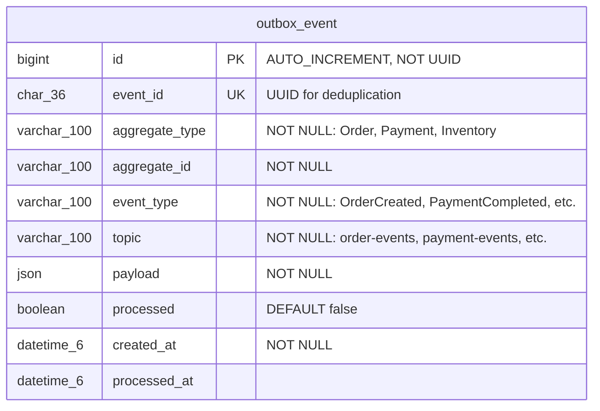

# FOUNDRY ERD — Database Schema Design

## Design Principles

| Principle | Decision | Rationale |
|-----------|----------|-----------|
| Primary Key | BIGINT AUTO_INCREMENT (internal) + ULID CHAR(26) (public API-facing entities) | Sequential inserts for InnoDB clustered index performance. ULID for URL-safe, non-enumerable external IDs |
| Relationships | Non-identifying (every entity has own surrogate PK) | JPA proxy compatibility, clean cascade, simpler equals/hashCode |
| Normalization | 3NF for catalog data, strategic denormalization for orders | Order snapshot is a correctness requirement, not a shortcut |
| Money | DECIMAL(19,4) + CHAR(3) currency code | Supports KRW/USD/JPY. Never FLOAT/DOUBLE |
| Soft Delete | `deleted_at DATETIME(6)` (NULL = active) | Products/variants referenced by historical orders |
| Audit | `created_at`, `updated_at` DATETIME(6) on all tables. Exception: append-only event tables (`inventory_event`, `drop_status_history`, `exchange_rate`) omit `updated_at` as rows are immutable | UTC timestamps via `@CreatedDate` / `@LastModifiedDate` |
| Optimistic Locking | `version INT` on Inventory | Concurrent drop purchases, `@Version` in JPA |
| Charset | `utf8mb4` / `utf8mb4_unicode_ci` | Korean, English, Japanese support |
| Enums | `VARCHAR` with `@Enumerated(STRING)` | Never ORDINAL — enum reordering breaks data |
| Order Currency | All items in one order share the customer's display currency | Settlement currency tracking is out of scope (stubbed) |

## Domain Groupings

| Domain | Tables | FK Policy |
|--------|--------|-----------|
| Catalog | brand, product, product_variant, product_translation, product_image | True FK |
| Inventory | inventory, inventory_event | True FK to product_variant |
| Drop | drop_event, drop_product, drop_status_history | True FK to brand, product_variant |
| Order | orders, order_item, order_status_history | True FK to customer, product_variant |
| Payment | payment, payment_event | True FK to orders |
| Customer | customer, customer_address | True FK |
| Infrastructure | exchange_rate | No FK (standalone reference data) |
| *[Phase 3+]* | outbox_event | Added when Kafka is introduced |

**Phase 1 (Monolith)**: All tables live in a single MySQL schema. All relationships use true FK constraints and JPA `@ManyToOne`/`@OneToMany` mappings. This is a real monolith — full referential integrity, full JPA navigation.

> **Phase 4 Migration Note**: When services are decomposed, the following FKs are dropped and replaced with plain BIGINT references + event-driven consistency: `orders.customer_id`, `order_item.product_variant_id`, `order_item.drop_event_id`, `payment.order_id`, `drop_event.brand_id`. See [Phase 3+ Additions](#phase-3-additions-kafka--outbox) for the outbox table added at that stage.

## ERD Diagram

```mermaid
erDiagram
    %% ============================================
    %% CATALOG CONTEXT
    %% ============================================

    brand {
        bigint id PK
        char_26 public_id UK "ULID"
        varchar_100 name "NOT NULL"
        varchar_100 slug UK "NOT NULL"
        char_2 country_of_origin "ISO 3166-1 alpha-2"
        varchar_50 style_category "AMERICANA, WORKWEAR, REPRO"
        smallint founded_year
        text description
        varchar_500 logo_url
        datetime_6 created_at "NOT NULL"
        datetime_6 updated_at "NOT NULL"
        datetime_6 deleted_at "NULL = active"
    }

    product {
        bigint id PK
        char_26 public_id UK "ULID"
        bigint brand_id FK "NOT NULL"
        varchar_150 slug UK "NOT NULL"
        varchar_50 category "NOT NULL: DENIM, OUTERWEAR, SHIRT, KNITWEAR, PANTS, ACCESSORY"
        varchar_50 era "nullable: 1940s_MILITARY, 1950s_WORKWEAR, 1960s_OUTDOOR"
        decimal_19_4 base_price_amount "NOT NULL"
        char_3 base_price_currency "NOT NULL, ISO 4217"
        decimal_19_4 price_usd "pre-calculated, NULL if base=USD"
        decimal_19_4 price_krw "pre-calculated, NULL if base=KRW"
        decimal_19_4 price_jpy "pre-calculated, NULL if base=JPY"
        decimal_4_1 fabric_weight_oz "e.g. 14.5"
        varchar_50 fabric_type "DENIM, CHAMBRAY, CANVAS, WOOL, COTTON"
        varchar_50 fabric_weave "SELVEDGE, RIGHT_HAND_TWILL, HERRINGBONE"
        datetime_6 created_at "NOT NULL"
        datetime_6 updated_at "NOT NULL"
        datetime_6 deleted_at "NULL = active"
    }

    product_translation {
        bigint id PK
        bigint product_id FK "NOT NULL"
        char_2 locale "NOT NULL: en, ko, ja (ISO 639-1)"
        varchar_255 name "NOT NULL"
        text description
        datetime_6 created_at "NOT NULL"
        datetime_6 updated_at "NOT NULL"
    }

    product_image {
        bigint id PK
        bigint product_id FK "NOT NULL"
        varchar_500 url "NOT NULL"
        smallint sort_order "NOT NULL, DEFAULT 0"
        boolean is_primary "DEFAULT false"
        datetime_6 created_at "NOT NULL"
        datetime_6 updated_at "NOT NULL"
    }

    product_variant {
        bigint id PK
        char_26 public_id UK "ULID"
        bigint product_id FK "NOT NULL"
        varchar_100 sku UK "NOT NULL"
        varchar_20 size_label "NOT NULL: S, M, L, 28x32, etc."
        varchar_50 color_name "Indigo Selvedge, Vintage Black"
        char_7 color_hex "#1C2D3E"
        decimal_19_4 price_override_amount "NULL = inherit from product"
        char_3 price_override_currency
        decimal_5_1 meas_chest_cm
        decimal_5_1 meas_shoulder_cm
        decimal_5_1 meas_sleeve_cm
        decimal_5_1 meas_body_length_cm
        decimal_5_1 meas_waist_cm
        decimal_5_1 meas_inseam_cm
        decimal_5_1 meas_thigh_cm
        decimal_5_1 meas_hem_cm
        datetime_6 created_at "NOT NULL"
        datetime_6 updated_at "NOT NULL"
        datetime_6 deleted_at "NULL = active"
    }

    brand ||--o{ product : "has"
    product ||--o{ product_translation : "translated"
    product ||--o{ product_image : "has"
    product ||--o{ product_variant : "has variants"

    %% ============================================
    %% INVENTORY CONTEXT
    %% ============================================

    inventory {
        bigint id PK
        bigint product_variant_id FK UK "NOT NULL, ONE-TO-ONE"
        int quantity_available "NOT NULL, DEFAULT 0"
        int quantity_reserved "NOT NULL, DEFAULT 0"
        int quantity_sold "NOT NULL, DEFAULT 0"
        int version "NOT NULL, DEFAULT 0, @Version optimistic lock"
        datetime_6 created_at "NOT NULL"
        datetime_6 updated_at "NOT NULL"
    }

    product_variant ||--|| inventory : "has stock"
    inventory ||--o{ inventory_event : "audited by"

    inventory_event {
        bigint id PK
        bigint inventory_id FK "NOT NULL"
        varchar_30 event_type "NOT NULL: RESERVED, DEDUCTED, RELEASED, COMPENSATION_RESTORE, ADJUSTMENT"
        varchar_30 trigger_type "NOT NULL: SYSTEM, SAGA_COMPENSATION, ADMIN, SCHEDULER"
        int quantity_change "NOT NULL, signed: +5 or -5"
        bigint order_id "nullable, which order triggered this"
        bigint drop_event_id "nullable, which drop context"
        varchar_500 reason "e.g. SAGA compensation: payment failed"
        datetime_6 created_at "NOT NULL"
    }

    %% ============================================
    %% DROP CONTEXT
    %% ============================================

    drop_event {
        bigint id PK
        char_26 public_id UK "ULID"
        varchar_200 name "NOT NULL"
        varchar_200 slug UK "NOT NULL"
        bigint brand_id FK "NOT NULL"
        text description "drop marketing copy"
        varchar_500 banner_image_url "hero image for drop page"
        varchar_20 status "NOT NULL: ANNOUNCED, OPEN, SELLING, SOLD_OUT, CLOSED"
        datetime_6 open_at "NOT NULL, scheduled open time"
        datetime_6 close_at "scheduled close time"
        datetime_6 actual_open_at "actual open time"
        datetime_6 actual_close_at "actual close time"
        datetime_6 created_at "NOT NULL"
        datetime_6 updated_at "NOT NULL"
    }

    drop_product {
        bigint id PK
        bigint drop_event_id FK "NOT NULL"
        bigint product_variant_id FK "NOT NULL"
        decimal_19_4 drop_price_amount "drop-specific price override"
        char_3 drop_price_currency
        int quantity_allocated "NOT NULL, units for this drop"
        int quantity_sold "NOT NULL, DEFAULT 0"
        tinyint max_per_customer "DEFAULT 1"
        smallint sort_order "NOT NULL, DEFAULT 0, display order"
        int version "NOT NULL, DEFAULT 0, @Version optimistic lock"
        datetime_6 created_at "NOT NULL"
        datetime_6 updated_at "NOT NULL"
    }

    drop_status_history {
        bigint id PK
        bigint drop_event_id FK "NOT NULL"
        varchar_20 from_status
        varchar_20 to_status "NOT NULL"
        varchar_20 changed_by_type "NOT NULL: SYSTEM, ADMIN, SCHEDULER"
        varchar_500 reason
        datetime_6 changed_at "NOT NULL"
        datetime_6 created_at "NOT NULL"
    }

    drop_event ||--o{ drop_product : "contains"
    drop_event ||--o{ drop_status_history : "tracks"
    product_variant ||--o{ drop_product : "featured in"

    %% ============================================
    %% CUSTOMER CONTEXT
    %% ============================================

    customer {
        bigint id PK
        char_26 public_id UK "ULID"
        varchar_100 email UK "NOT NULL"
        varchar_255 password_hash "NOT NULL"
        varchar_50 name "NOT NULL"
        char_3 preferred_currency "DEFAULT USD"
        char_2 preferred_locale "DEFAULT en, ISO 639-1"
        varchar_20 role "NOT NULL: CUSTOMER, ADMIN"
        datetime_6 created_at "NOT NULL"
        datetime_6 updated_at "NOT NULL"
        datetime_6 deleted_at "NULL = active"
    }

    customer_address {
        bigint id PK
        char_26 public_id UK "ULID, for API access"
        bigint customer_id FK "NOT NULL"
        varchar_50 label "Home, Office, etc."
        varchar_100 recipient_name "NOT NULL"
        varchar_20 phone "NOT NULL"
        varchar_255 street "NOT NULL"
        varchar_255 detail
        varchar_100 city "NOT NULL"
        varchar_100 state_province
        varchar_20 postal_code "NOT NULL"
        char_2 country "NOT NULL, ISO 3166-1 alpha-2"
        boolean is_default "DEFAULT false"
        datetime_6 created_at "NOT NULL"
        datetime_6 updated_at "NOT NULL"
        datetime_6 deleted_at "NULL = active"
    }

    customer ||--o{ customer_address : "has"

    %% ============================================
    %% ORDER CONTEXT (denormalized snapshots)
    %% ============================================

    orders {
        bigint id PK
        char_26 public_id UK "ULID"
        bigint customer_id FK "NOT NULL"
        varchar_100 customer_email "snapshot for notifications"
        varchar_30 status "NOT NULL: PENDING, PAYMENT_PROCESSING, PAID, CONFIRMED, SHIPPED, DELIVERED, CANCELLED, REFUNDED"
        char_3 currency "NOT NULL, customer display currency"
        bigint exchange_rate_id "nullable, NULL if same-currency order"
        decimal_19_8 exchange_rate_snapshot "rate used at order time, for audit"
        char_3 exchange_rate_base "base currency of the rate, e.g. USD"
        decimal_19_4 subtotal_amount "NOT NULL, denormalized sum"
        decimal_19_4 duty_amount "NOT NULL, estimated flat rate (same currency)"
        decimal_19_4 total_amount "NOT NULL"
        varchar_100 shipping_recipient "snapshot"
        varchar_20 shipping_phone "snapshot"
        varchar_255 shipping_street "snapshot"
        varchar_255 shipping_detail "snapshot"
        varchar_100 shipping_city "snapshot"
        varchar_100 shipping_state "snapshot"
        varchar_20 shipping_postal_code "snapshot"
        char_2 shipping_country "snapshot"
        varchar_50 shipping_status "PENDING, PREPARING, SHIPPED, DELIVERED"
        char_36 idempotency_key UK "duplicate order prevention"
        datetime_6 created_at "NOT NULL"
        datetime_6 updated_at "NOT NULL"
    }

    order_item {
        bigint id PK
        bigint order_id FK "NOT NULL"
        bigint product_variant_id FK "NOT NULL"
        bigint drop_event_id FK "nullable, which drop this was from"
        varchar_100 sku "snapshot"
        varchar_255 product_name "snapshot"
        varchar_100 brand_name "snapshot"
        varchar_100 variant_label "snapshot: M / Indigo Selvedge"
        varchar_500 product_image_url "snapshot for order history display"
        varchar_200 drop_name "nullable snapshot if from drop"
        decimal_19_4 unit_price_amount "snapshot, NOT NULL"
        char_3 unit_price_currency "snapshot, NOT NULL"
        int quantity "NOT NULL, DEFAULT 1"
        decimal_19_4 line_total_amount "NOT NULL, same currency as unit_price"
        datetime_6 created_at "NOT NULL"
        datetime_6 updated_at "NOT NULL"
    }

    order_status_history {
        bigint id PK
        bigint order_id FK "NOT NULL"
        varchar_30 from_status
        varchar_30 to_status "NOT NULL"
        varchar_20 changed_by_type "NOT NULL: SYSTEM, CUSTOMER, ADMIN"
        varchar_500 reason
        datetime_6 changed_at "NOT NULL"
        datetime_6 created_at "NOT NULL, immutable append-only"
    }

    orders ||--o{ order_item : "contains"
    orders ||--o{ order_status_history : "tracks"

    %% ============================================
    %% PAYMENT CONTEXT
    %% ============================================

    payment {
        bigint id PK
        char_26 public_id UK "ULID"
        bigint order_id FK "NOT NULL"
        varchar_30 status "NOT NULL: PENDING, PROCESSING, COMPLETED, FAILED, REFUNDED"
        varchar_30 method "CREDIT_CARD, BANK_TRANSFER (stubbed)"
        decimal_19_4 amount "NOT NULL"
        char_3 currency "NOT NULL"
        varchar_100 pg_transaction_id "external PG reference (stubbed)"
        char_36 idempotency_key UK "duplicate payment prevention"
        datetime_6 created_at "NOT NULL"
        datetime_6 updated_at "NOT NULL"
    }

    payment_event {
        bigint id PK
        bigint payment_id FK "NOT NULL"
        varchar_30 event_type "NOT NULL: INITIATED, AUTHORIZED, CAPTURED, FAILED, REFUND_INITIATED, REFUNDED"
        varchar_30 trigger_type "NOT NULL: CUSTOMER_REQUEST, SAGA_COMPENSATION, SYSTEM, ADMIN"
        varchar_500 detail "error message, PG response, etc."
        datetime_6 occurred_at "NOT NULL"
        datetime_6 created_at "NOT NULL"
        datetime_6 updated_at "NOT NULL"
    }

    payment ||--o{ payment_event : "logs"

    %% Cross-domain FK relationships (true FK in Phase 1 monolith)
    customer ||--o{ orders : "places"
    orders ||--o{ payment : "paid by"
    brand ||--o{ drop_event : "hosts"
    product_variant ||--o{ order_item : "ordered as"
    drop_event ||--o{ order_item : "sourced from"

    %% ============================================
    %% INFRASTRUCTURE
    %% ============================================

    exchange_rate {
        bigint id PK
        char_3 from_currency "NOT NULL, ISO 4217"
        char_3 to_currency "NOT NULL, ISO 4217"
        decimal_19_8 rate "NOT NULL"
        date effective_date "NOT NULL"
        datetime_6 created_at "NOT NULL, immutable row - no updated_at"
    }
```

## Key Design Decisions

### 1. Order Snapshot Pattern

`order_item` stores `product_name`, `brand_name`, `variant_label`, `unit_price_amount/currency`, `sku`, `product_image_url`, `drop_name` at order creation time. The `product_variant_id` and `drop_event_id` are kept as plain BIGINT references for analytics but are **never used to display order details to users**. This ensures order accuracy even after product price changes or deletions.

### 2. Money as Value Object

All monetary values use the pair `DECIMAL(19,4)` + `CHAR(3)` (ISO 4217 currency code). In JPA, this maps to an `@Embeddable Money` class with `BigDecimal amount` and `String currency`. `line_total_amount` in order_item always shares the same currency as `unit_price_currency` — a single order contains items in one consistent currency (the customer's display currency).

### 3. Order Currency Policy

All items in a single order are converted to the **customer's preferred display currency** at order creation time using the current exchange rate. The `orders.currency` field represents this display/settlement currency. This means:
- A Korean customer buying an RRL (USD) product sees and pays in KRW
- The `order_item.unit_price_amount/currency` reflects the converted KRW price at order time
- The specific exchange rate used is recorded directly on the `orders` table: `exchange_rate_id` (FK to `exchange_rate`), `exchange_rate_snapshot` (the rate value), and `exchange_rate_base` (the source currency). For same-currency orders, these fields are NULL.
- This dual recording (reference + snapshot) ensures financial auditability: the snapshot preserves the exact rate even if the `exchange_rate` table is corrected later.
- Brand-side settlement in native currency is out of scope (would require a separate settlement service)

### 4. Multi-Currency on Product (Intentional 3NF Violation)

Products store `base_price` (brand's native currency) plus pre-calculated `price_usd`, `price_krw`, `price_jpy`. This is an intentional denormalization to avoid runtime currency conversion on every product listing. Trade-off: adding a 4th currency requires a schema migration. This is accepted per PRD: "only KRW/USD/JPY, no generic multi-currency engine."

### 5. Garment Measurements on Variant

Measurements stored as flat `DECIMAL(5,1)` columns directly on `product_variant`. NULL for inapplicable measurements (e.g., `meas_inseam_cm` on a jacket). Enables SQL range queries for size comparison without EAV joins.

### 6. Translation Table for i18n

`product_translation` stores per-locale (en/ko/ja) names and descriptions using ISO 639-1 two-character locale codes (`CHAR(2)`). Adding a new locale requires zero schema changes. Application layer implements fallback logic.

### 7. Drop as First-Class Entity with Allocation

`drop_event` is its own table with content fields (`description`, `banner_image_url`) for the drop page. `drop_product` tracks per-variant allocation with `quantity_allocated` and `quantity_sold`, enabling "42/100 remaining" displays. `sort_order` controls display ordering within a drop. This separation from total `inventory` allows a variant with 200 total stock to allocate only 100 to a specific drop.

**Over-allocation prevention**: The application layer MUST validate that `SUM(drop_product.quantity_allocated)` for all active drops (status IN ANNOUNCED, OPEN, SELLING) does not exceed `inventory.quantity_available` when creating a `drop_product` record. This is enforced in the service layer, not via DB constraint (cross-row validation is impractical in MySQL without triggers).

**Source of truth**: `inventory` is the authoritative source for actual stock levels. `drop_product.quantity_sold` is a denormalized counter updated atomically in the same transaction as `inventory` (monolith phase) or via event-driven eventual consistency (MSA phase). `drop_product` has its own `@Version` column for optimistic locking to prevent concurrent update races on the counter. In case of drift, `inventory` wins and `drop_product.quantity_sold` can be reconciled from `inventory_event` records.

**Drop status audit**: `drop_status_history` tracks all lifecycle transitions (ANNOUNCED → OPEN → SELLING → SOLD_OUT → CLOSED) with who/when/why, analogous to `order_status_history`.

### 8. Inventory Isolation with Optimistic Locking

`inventory` is a separate table with `@Version` for optimistic locking. During high-contention drops, the service layer can escalate to `SELECT FOR UPDATE` (pessimistic locking). Catalog and Inventory contexts share the same database in monolith but can be separated later.

**Retry strategy**: On `OptimisticLockException`, the application retries up to 3 times with exponential backoff (50ms, 100ms, 200ms). After 3 failures, return 409 Conflict to the client. For extreme contention (drop spike with >100 concurrent requests per variant), the service escalates to `SELECT ... FOR UPDATE` with a 500ms lock wait timeout to serialize writes.

**Inventory audit**: Every inventory mutation (reserve, deduct, release, SAGA compensation) is recorded in `inventory_event` with the signed quantity change, triggering order/drop reference, and reason. This provides a complete audit trail independent of Kafka event delivery, satisfying the 0% oversell requirement by enabling reconciliation.

### 9. [Phase 3+] Outbox Pattern (BIGINT PK, not UUID)

*This table is introduced in Phase 3 when Kafka is added. It does not exist in Phase 1.*

`outbox_event` uses `BIGINT AUTO_INCREMENT` as PK (not UUID) to avoid InnoDB page splitting on a high-write table. A separate `event_id CHAR(36) UUID` column with unique index serves as the deduplication key for consumers. The `topic` column explicitly stores the Kafka destination topic.

### 10. Cross-Domain Relationships

In Phase 1 (monolith), `orders.customer_id`, `order_item.product_variant_id`, `payment.order_id`, `drop_event.brand_id` use true FK constraints with JPA `@ManyToOne` mappings. This provides full referential integrity and navigation.

**Phase 4 migration**: These FKs are dropped when services get their own databases. Replaced with plain BIGINT references + event-driven consistency via the outbox pattern.

### 11. No Server-Side Cart

Cart is client-side only (Zustand + localStorage) per the frontend plan. There is no `cart` or `cart_item` table. Stock validation happens at order creation time via `POST /api/orders`. This is a deliberate simplification — server-side cart with reservation would add significant complexity without clear value when there is no inventory reservation system.

### 12. JWT Authentication (Stateless)

Authentication uses stateless JWTs with no server-side refresh token storage. There is no `refresh_token` table. Token rotation, if needed later, would be implemented as a separate auth service concern.

### 13. Soft Delete Policies

Soft delete (`deleted_at DATETIME(6)`) applies to: `product`, `product_variant`, `customer`, `customer_address`, `brand`. Enforcement rules:
- **Product/Variant**: Cannot soft-delete a variant that has active drop allocations (`drop_product` with `quantity_sold < quantity_allocated` in a non-CLOSED/SOLD_OUT drop). Enforced in application layer.
- **Customer**: Cannot soft-delete while orders in non-terminal status exist (PENDING, PAYMENT_PROCESSING, PAID, CONFIRMED, SHIPPED). Enforced in application layer.
- **Brand**: Cannot soft-delete while active products or active drops reference it.
- **Drop events**: No soft delete. Drops follow a lifecycle (ANNOUNCED → CLOSED) and are never deleted. Historical drops remain for analytics and order history display.
- **Cascading**: Soft-deleting a product does NOT cascade to variants (explicit per-variant delete required). Soft-deleting a customer does NOT affect existing orders (orders use snapshot data).

### 14. Idempotency Strategy

`orders.idempotency_key` and `payment.idempotency_key` are `CHAR(36) UNIQUE` columns for duplicate prevention.
- **Generation**: Client generates a UUID v4 before submitting the order/payment request. The same key is reused on retries.
- **On conflict**: The server returns the existing order/payment (HTTP 200) instead of creating a duplicate. No error is returned.
- **TTL**: Idempotency keys are permanent (tied to the order lifecycle). No cleanup needed since they map 1:1 with orders.
- **Drop context**: During high-concurrency drops, the client generates the key on "Add to Cart" click and holds it through checkout, ensuring double-click and network retry safety.

### 15. [Phase 4+] SAGA Event Distinction

*The `SAGA_COMPENSATION` trigger type values are used starting in Phase 4. In Phase 1, only `SYSTEM`, `CUSTOMER_REQUEST`, and `ADMIN` values appear.*

`payment_event.trigger_type` distinguishes between `CUSTOMER_REQUEST` (manual refund), `SAGA_COMPENSATION` (automated rollback), `SYSTEM` (scheduled jobs), and `ADMIN` (manual intervention). This enables querying "all SAGA compensation events" without parsing free-text detail fields. The same pattern applies to `order_status_history.changed_by_type`.

## Index Strategy

| Table | Index | Columns | Purpose |
|-------|-------|---------|---------|
| product | idx_product_brand | brand_id | Brand page product listing |
| product | idx_product_category_deleted | (category, deleted_at) | Category filtering with soft delete |
| product_translation | uk_translation | (product_id, locale) UNIQUE | One translation per locale |
| product_image | idx_image_product | product_id | Product detail image loading |
| product_variant | idx_variant_product | product_id | Product detail variant list |
| product_variant | idx_variant_sku | sku | SKU lookup |
| product_variant | idx_variant_deleted | deleted_at | Soft delete filter |
| inventory | idx_inventory_variant | product_variant_id UNIQUE | One-to-one variant lookup |
| drop_event | idx_drop_status | status | Active drops query |
| drop_event | idx_drop_open_at | open_at | Upcoming drops sort |
| drop_event | idx_drop_brand | brand_id | Brand drops query |
| drop_product | uk_drop_variant | (drop_event_id, product_variant_id) UNIQUE | No duplicate variant in drop |
| drop_product | idx_drop_product_variant | product_variant_id | Find drops containing variant |
| customer_address | idx_address_customer | customer_id | Customer address list |
| orders | idx_orders_customer | customer_id | Customer order history |
| orders | idx_orders_status | status | Status-filtered queries |
| orders | idx_orders_customer_created | (customer_id, created_at DESC) | Recent orders per customer |
| order_item | idx_order_item_order | order_id | Order items lookup |
| order_status_history | idx_status_history_order | order_id | Order status timeline |
| payment | idx_payment_order | order_id | Order payment lookup |
| payment_event | idx_payment_event_payment | payment_id | Payment event log |
| inventory_event | idx_inv_event_inventory | inventory_id | Inventory audit trail |
| inventory_event | idx_inv_event_order | order_id | Order-related inventory events |
| drop_status_history | idx_drop_status_history_event | drop_event_id | Drop transition timeline |
| exchange_rate | idx_rate_currencies_date | (from_currency, to_currency, effective_date DESC) | Rate lookup |
| *[Phase 3+]* outbox_event | idx_outbox_processed | (processed, created_at) | Unprocessed events polling |

## Entity Relationship Summary

| Relationship | Type | Cardinality | Context Boundary |
|-------------|------|-------------|-----------------|
| Brand → Product | One-to-Many | 1 brand has N products | Within Catalog |
| Product → ProductTranslation | One-to-Many | 1 product has N translations (max 3) | Within Catalog |
| Product → ProductImage | One-to-Many | 1 product has N images | Within Catalog |
| Product → ProductVariant | One-to-Many | 1 product has N variants (size/color) | Within Catalog |
| ProductVariant → Inventory | One-to-One | 1 variant has exactly 1 inventory record | Catalog ↔ Inventory (same service) |
| Inventory → InventoryEvent | One-to-Many | 1 inventory record has N mutation events | Within Inventory |
| DropEvent → DropProduct | One-to-Many | 1 drop contains N variant allocations | Within Drop |
| DropEvent → DropStatusHistory | One-to-Many | 1 drop has N status transitions | Within Drop |
| ProductVariant → DropProduct | One-to-Many | 1 variant can appear in N drops | Catalog ↔ Drop (same service) |
| Customer → CustomerAddress | One-to-Many | 1 customer has N addresses | Within Customer |
| Order → OrderItem | One-to-Many | 1 order has N line items | Within Order |
| Order → OrderStatusHistory | One-to-Many | 1 order has N status transitions | Within Order |
| Payment → PaymentEvent | One-to-Many | 1 payment has N event logs | Within Payment |
| Customer → Order | One-to-Many | 1 customer places N orders | Cross-domain (true FK in Phase 1, dropped in Phase 4) |
| Order → Payment | One-to-Many | 1 order has N payment attempts | Cross-domain (true FK in Phase 1, dropped in Phase 4) |
| Brand → DropEvent | One-to-Many | 1 brand hosts N drops | Cross-domain (true FK in Phase 1, dropped in Phase 4) |
| ProductVariant → OrderItem | One-to-Many | 1 variant ordered in N line items | Cross-domain (true FK in Phase 1, dropped in Phase 4) |
| DropEvent → OrderItem | One-to-Many | 1 drop sources N line items | Cross-domain (true FK in Phase 1, dropped in Phase 4) |

---

## Phase 3+ Additions (Kafka & Outbox)

*The following table is added in Phase 3 when Kafka is introduced for async order-payment communication. It does not exist in the Phase 1 monolith schema.*



**Index**: `idx_outbox_processed (processed, created_at)` — polls unprocessed events for Kafka relay.

## Phase 4 Migration: MSA Service Mapping

*When services are decomposed in Phase 4, tables are distributed as follows:*

| Service | Tables | Own DB |
|---------|--------|--------|
| Product Service | brand, product, product_variant, product_translation, product_image, inventory, inventory_event, drop_event, drop_product, drop_status_history | product_db |
| Order Service | orders, order_item, order_status_history, outbox_event | order_db |
| Payment Service | payment, payment_event, outbox_event | payment_db |
| Auth/Customer Service | customer, customer_address | customer_db |
| Shared | exchange_rate | per-service copy or shared config |

**FKs dropped at this stage**: `orders.customer_id`, `order_item.product_variant_id`, `order_item.drop_event_id`, `payment.order_id`, `drop_event.brand_id`. These become plain BIGINT references with consistency maintained via Kafka events + outbox pattern.
